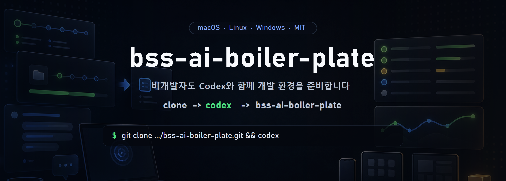

<div align="center">



### 명령어 한 줄로, 새 컴퓨터를 완전한 개발 환경으로.

_런타임 · 셸 · 컨테이너 · AI 코딩 에이전트까지 — 설치부터 검증까지 자동으로._

[](https://github.com/Heoooooon/lazy-starter-kit/actions/workflows/ci.yml)
[](https://github.com/Heoooooon/lazy-starter-kit/releases)
[](./LICENSE)
[](#)
[](https://github.com/Heoooooon/lazy-starter-kit/stargazers)

**한국어** · [English](./README.en.md) · [설치 흐름 보기 ↗](https://heoooooon.github.io/lazy-starter-kit/) · [변경 이력](./CHANGELOG.md)

</div>

---

## 이게 뭔가요? (1분 설명)

새 노트북/PC를 받으면 개발에 필요한 도구를 **하나하나 찾아 깔아야** 합니다. 이 키트는 그걸
**명령어 한 줄**로 대신 해줍니다. 붙여넣고 Enter만 누르면:

- 자주 쓰는 **CLI 도구**(git, ripgrep, fzf, bat 등)
- **프로그래밍 런타임**(Node.js, Python, Go, Rust)
- **예쁜 터미널/프롬프트**(starship) + 자동완성
- **컨테이너**(Docker) 준비
- **AI 코딩 에이전트**(gajae-code, codex 등)

까지 알아서 깔고, **제대로 깔렸는지 검증**까지 합니다.

> **안심하세요.** 이 키트는 **당신 설정을 함부로 덮어쓰지 않습니다.** 이미 있는 건 건너뛰고,
> 몇 번을 다시 돌려도 안전(멱등)하며, 설치한 걸 **되돌리는 제거 스크립트**도 있습니다.
> 자세한 안전 설계는 아래 [설치해도 안전한가요?](#설치해도-안전한가요) 참고.

---

## 먼저, 내 컴퓨터부터 고르세요

| 내 컴퓨터 | 여기로 |
|---|---|
| 🪟 **Windows** (회사 PC 대부분) | [→ Windows 설치](#-windows-설치-제일-자세히) |
| 🍎 **Mac** (맥북 등) | [→ macOS 설치](#-macos-설치) |
| 🐧 **Linux** (우분투/페도라 등) | [→ Linux 설치](#-linux-설치) |

각 OS는 폴더로 분리돼 있어 필요한 것만 받아 쓸 수 있어요:
[`windows/`](./windows/README.md) · [`linux/`](./linux/README.md) · macOS(이 저장소 최상위).

---

## 🪟 Windows 설치 (제일 자세히)

> 대상: **Windows 10(1809 이상) 또는 Windows 11**. 대부분의 회사 PC가 여기 해당합니다.
> 개발 경험이 전혀 없어도 아래만 그대로 따라 하면 됩니다.

### 1단계 — PowerShell 열기

1. 키보드에서 **`Windows 키`** 를 누르거나 화면 왼쪽 아래 **시작 버튼**을 클릭합니다.
2. 그대로 **`powershell`** 이라고 타이핑합니다.
3. 목록에 뜨는 **"Windows PowerShell"** 을 클릭해서 엽니다. (파란색 또는 검은색 창이 떠요.)

> 더 좋은 경험을 원하면 "터미널"(Windows Terminal)에서 PowerShell을 열어도 됩니다. 없으면 그냥 Windows PowerShell로 충분해요.

### 2단계 — 아래 한 줄을 붙여넣고 Enter

아래 회색 상자 오른쪽 위의 **복사 버튼**(📋)을 누르세요. 그리고 PowerShell 창을 **한 번 클릭**한 뒤
**마우스 오른쪽 버튼**을 누르면 붙여넣기가 됩니다. 마지막으로 **Enter**.

```powershell
irm https://raw.githubusercontent.com/Heoooooon/lazy-starter-kit/main/windows/install.ps1 | iex
```

- `git`이 없어도 **자동으로 깔아줍니다.** (그냥 기다리면 돼요.)
- 중간에 설치 진행 상황이 주르륵 올라갑니다. 컴퓨터/인터넷 속도에 따라 **5~20분** 걸릴 수 있어요. 창을 닫지 말고 기다리세요.
- 도중에 "Docker Desktop을 설치할까요?" 같은 **질문이 뜨면** 필요 없으면 그냥 `n` 입력 후 Enter (회사 라이선스 이슈가 있어 기본은 설치 안 함).

<details>
<summary><b>"스크립트를 실행할 수 없습니다" 같은 빨간 오류가 뜨면?</b> (클릭)</summary>

Windows 보안 정책 때문일 수 있어요. 아래 **한 줄로 대신 실행**하세요(복붙 → Enter):

```powershell
powershell -ExecutionPolicy Bypass -Command "irm https://raw.githubusercontent.com/Heoooooon/lazy-starter-kit/main/windows/install.ps1 | iex"
```
</details>

### 3단계 — 끝나면 딱 3가지만

설치가 끝나면 화면 맨 아래에 **"Next steps"** 안내가 나옵니다. 그대로 하면 돼요:

1. **PowerShell 창을 완전히 닫고 새로 여세요.** (그래야 새 설정이 적용돼요.)
2. **글꼴 설정** — 프롬프트 아이콘이 예쁘게 보이려면:
   Windows Terminal → **설정(Settings)** → 사용하는 프로필 → **모양(Appearance)** →
   **글꼴(Font face)** 을 **`JetBrainsMono Nerd Font`** 로 바꾸세요.
3. **GitHub 로그인**(선택) — 화면에 `gh auth login` 안내가 나오면 한 번 실행해서 GitHub 계정에 로그인하세요. (git 이름/이메일도 자동으로 맞춰줍니다.)

> **자동완성 써보기**: 새 창에서 명령어를 치기 시작하면 **회색 글씨로 뒷부분을 미리 제안**해줍니다.
> 마음에 들면 **오른쪽 화살표(→)** 를 눌러 그대로 채워요. (zsh의 autosuggestions 같은 기능이에요.)
> 안 뜨면 **PowerShell 7**을 쓰는 게 확실합니다: `winget install Microsoft.PowerShell` 후 재시작.

### 회사 PC에서 자주 겪는 문제 (Windows)

| 증상 | 해결 |
|---|---|
| `winget`을 찾을 수 없다 | Microsoft Store에서 **"앱 설치 관리자(App Installer)"** 설치 후 다시 실행 |
| 일부 도구가 "MISS"로 빠짐 | **관리자 권한(UAC)** 이 필요한 패키지예요. 관리자 PowerShell에서 `.\install.ps1 -Only packages` 재실행하거나 사내 소프트웨어 포털 이용 |
| 회사 프록시 뒤라 다운로드 실패 | PowerShell에서 `$env:HTTPS_PROXY="http://프록시주소:포트"` 설정 후 재실행 |
| 회사 정책(AppLocker 등)으로 스크립트 자체 차단 | 정책상 실행 불가 — IT 담당자 문의 |

📖 **Windows 상세 문서**: [windows/README.md](./windows/README.md)

---

## 🍎 macOS 설치

> 대상: **Apple Silicon 맥**(M1/M2/M3/M4…). 새 맥에 최적화돼 있어요.

### 1단계 — 터미널 열기

`Command(⌘) + Space` → **`터미널`** 또는 **`Terminal`** 입력 → Enter.

### 2단계 — 한 줄 붙여넣고 Enter

```sh
curl -fsSL https://raw.githubusercontent.com/Heoooooon/lazy-starter-kit/main/install.sh | bash
```

- `git`이 없는 완전 새 맥이면 먼저 **Xcode Command Line Tools** 설치 창이 뜹니다. **"설치"** 를 누르고, 끝나면 위 명령어를 **한 번 더** 실행하세요.
- 중간에 **Mac 비밀번호**를 한 번 물을 수 있어요(Homebrew 설치 시). 정상입니다.

### 3단계 — 끝나면

- **새 터미널을 열거나** `source ~/.zshrc` 실행.
- 안내에 따라 `gh auth login`(GitHub 로그인), 터미널 글꼴을 `JetBrainsMono Nerd Font`로 설정.

> 실행 전에 **무엇을 하는지 먼저 보고 싶다면**(권장):
> ```sh
> git clone https://github.com/Heoooooon/lazy-starter-kit.git
> cd lazy-starter-kit
> ./install.sh --dry-run   # 아무것도 안 바꾸고 계획만 출력
> ./install.sh             # 실제 적용
> ```

---

## 🐧 Linux 설치

> 지원: **Debian/Ubuntu, Fedora/RHEL, Arch, openSUSE** (glibc 배포판). 패키지 매니저를 **자동 감지**합니다.
> ⚠️ **Alpine(musl)은 미지원** — 업스트림 도구(node/ast-grep/bun)에 musl 빌드가 없어요.

### 1단계 — 터미널 열기 → 2단계 — 한 줄 붙여넣고 Enter

```sh
curl -fsSL https://raw.githubusercontent.com/Heoooooon/lazy-starter-kit/main/linux/install.sh | bash
```

- 시스템 패키지 설치에 **sudo(관리자) 비밀번호**를 물을 수 있어요.
- Docker는 물어볼 때 동의해야만 설치됩니다(무거워서 기본은 건너뜀).

### 3단계 — 끝나면

- **새 터미널을 열거나** `source ~/.zshrc`.
- Docker를 깔았다면 **로그아웃 후 다시 로그인**(또는 `newgrp docker`)해야 권한이 적용돼요.

📖 **Linux 상세 문서**: [linux/README.md](./linux/README.md)

---

## 무엇이 깔리나

| 계층 | 도구 |
|---|---|
| **CLI 기본** | git, gh(GitHub CLI), jq, ripgrep(rg), fd, fzf, bat, tree, ast-grep |
| **셸/프롬프트** | zsh + oh-my-zsh + 자동완성·구문강조, **starship** 프롬프트, JetBrainsMono Nerd Font (Windows는 PowerShell 프로필 + PSReadLine 자동완성) |
| **런타임** | **mise** → Node(LTS)·Python·Go · **rustup** → Rust + rust-analyzer · **uv** · **bun** |
| **컨테이너** | macOS=Colima, Linux=Docker Engine(선택), Windows=Docker Desktop(선택·라이선스 주의) |
| **Git/GitHub** | 계정 신원(이메일), HTTPS 자격증명, 합리적 기본값 |
| **AI 에이전트** | **gajae-code**(`gjc`), **codex**, **lazycodex**(OmO) (+ macOS/Linux는 Hermes) |

> 세부 목록·OS별 차이는 각 OS 상세 문서에 있어요.

---

## 설치해도 안전한가요?

네. 안전을 최우선으로 설계했습니다.

- **덮어쓰지 않음**: 이미 깔린 도구/설정은 건너뜁니다. 당신이 만든 파일은 보존돼요.
- **멱등(idempotent)**: 몇 번을 다시 돌려도 문제 없습니다.
- **표시된 블록만 편집**: 설정 파일(`~/.zshrc`, PowerShell 프로필 등)에는 `# >>> lazy-starter-kit ... >>>` 로
  **명확히 표시된 구역**만 넣고, 재실행 시 그 구역만 교체합니다(중복 없음). 손으로 쓴 줄은 안 건드려요.
- **git 신원 보호**: 이름/이메일이 **비어 있을 때만** 채우고, 있으면 절대 안 바꿉니다.
- **데이터 삭제 없음**: 설치 과정에서 당신 데이터를 지우지 않습니다.
- **되돌리기 제공**: 아래 [제거](#지우고-싶어요-제거)로 깔끔히 원복.

> 정말 걱정되면 **먼저 `--dry-run`(맥/리눅스) 또는 `-DryRun`(윈도우)** 으로 "무엇을 할지"만 확인하세요.
> 남의/회사 메인 PC라면 **여분 PC나 가상머신(VM)에서 먼저** 테스트하는 걸 권합니다.

> **검증**: **macOS·Windows(Server 2025)·Ubuntu** 는 커밋마다 설치→검증→제거를
> 자동 테스트(CI)로 돌립니다. **Fedora·openSUSE·Arch** 는 CI에는 없고, 손으로
> 직접 설치→검증→제거(end-to-end)까지 확인했어요.

---

## 지우고 싶어요 (제거)

설치한 것을 의존성 역순으로 되돌립니다. (위험한 항목은 물어보고 진행)

**macOS**
```sh
cd lazy-starter-kit && ./uninstall.sh          # 물어보며 제거
./uninstall.sh --yes                            # 다 자동 수락
```
**Linux**
```sh
cd lazy-starter-kit/linux && ./uninstall.sh
```
**Windows** (PowerShell)
```powershell
cd lazy-starter-kit\windows; .\uninstall.ps1
```

- **git 신원, git 자체, 폰트, Homebrew/빌드도구**는 자동으로 안 지웁니다.
- **gajae-code(`gjc`)는 보존** — 지우려면 `--with-gajae`(맥/리눅스) / `-WithGajae`(윈도우).

---

## 자주 묻는 질문 (FAQ)

**Q. 이미 Node/Python이 깔려 있어요. 충돌 안 나요?**
지우지 않습니다. mise가 **자기 버전을 깔고 PATH로 우선**시켜요(shadow). 기존 것은 그대로 남습니다.
확인: 맥/리눅스 `which -a node`, 윈도우 `Get-Command node -All`.

**Q. 설치가 중간에 실패했어요.**
대부분 네트워크/권한 문제예요. **다시 실행해도 안전**합니다(이미 된 건 건너뜀).
특정 단계만 다시: `--only <단계>`(맥/리눅스), `-Only <단계>`(윈도우).

**Q. 관리자 권한이 없어요(회사 PC).**
Windows는 가능한 건 **사용자 범위로 설치**하고, 관리자가 필요한 것만 끝에 목록으로 알려줍니다.
Linux는 sudo가 없으면 시스템 패키지는 건너뛰고 사용자 도구는 정상 설치돼요.

**Q. 특정 버전으로 고정해서 설치하려면?**
```sh
STARTER_KIT_BRANCH=v0.1.0 bash -c "$(curl -fsSL https://raw.githubusercontent.com/Heoooooon/lazy-starter-kit/v0.1.0/install.sh)"
```

---

## 고급 / 커스터마이즈

- **단계 선택 실행**: `--only`, `--skip`, `--dry-run`, `--yes`, `--list`, `--version` (윈도우는 `-Only` 처럼 대시 하나).
- **설치 도구 편집**: 각 OS의 `Brewfile`(맥) / `scripts/02-packages.*` / `scripts/03-runtimes.*`.
- **프롬프트/셸 블록**: `config/starship.toml`, `config/zshrc.block.sh`(맥/리눅스), `config/profile.block.ps1`(윈도우).
- 자세한 옵션·문제해결은 각 OS 상세 문서를 보세요.

---

## 크레딧

이 키트는 훌륭한 오픈소스들을 엮은 것뿐입니다. 원작 프로젝트에 ⭐를 눌러주세요:
[Homebrew](https://brew.sh) · [mise](https://github.com/jdx/mise) · [starship](https://github.com/starship/starship) ·
[rustup](https://github.com/rust-lang/rustup) · [bun](https://github.com/oven-sh/bun) · [uv](https://github.com/astral-sh/uv) ·
[Oh My Zsh](https://github.com/ohmyzsh/ohmyzsh) · [ripgrep](https://github.com/BurntSushi/ripgrep) ·
[fd](https://github.com/sharkdp/fd) · [bat](https://github.com/sharkdp/bat) · [fzf](https://github.com/junegunn/fzf) ·
[ast-grep](https://github.com/ast-grep/ast-grep) · [Colima](https://github.com/abiosoft/colima) ·
[gajae-code](https://github.com/Yeachan-Heo/gajae-code) · [Codex](https://github.com/openai/codex) ·
[lazycodex / OmO](https://github.com/code-yeongyu/lazycodex) · [Hermes Agent](https://github.com/NousResearch/hermes-agent)

## 라이선스

MIT — [LICENSE](./LICENSE) 참고.
